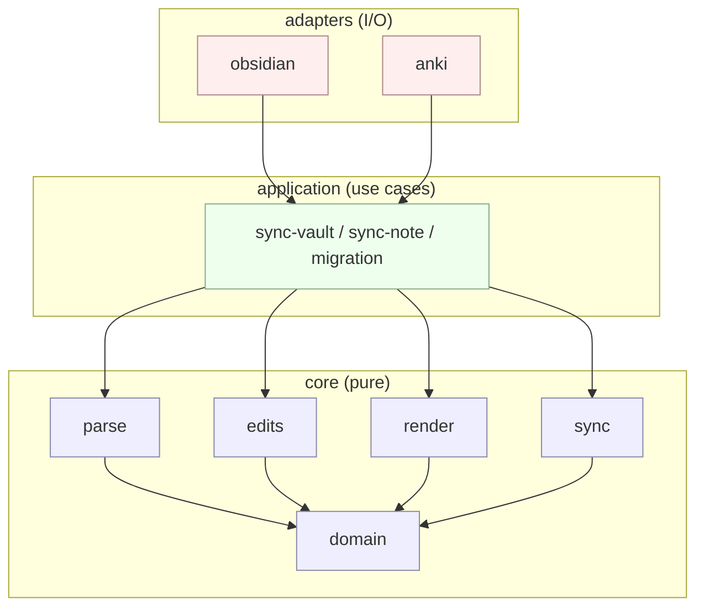
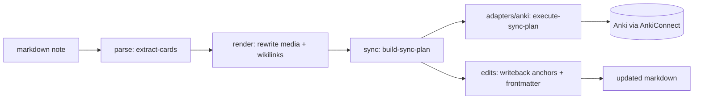

# Architecture Overview (v2)

Two views of the same code: **layers** (static structure) and **pipeline** (runtime flow).

The layer rules below are mechanically enforced by `npm run arch:check`
(see `.dependency-cruiser.cjs`). If a diagram edge here doesn't exist in
the rules, the diagram is wrong — fix one or the other.

## Layers

**Rule**: `core` knows nothing about `application` or `adapters`.
`application` knows nothing about `adapters`. Adapters are leaves.

## v2 sync pipeline

Inputs: a note's markdown + frontmatter, plus prior sync state.
Outputs: (a) Anki mutations, (b) writebacks to the note (anchors, card
frontmatter, hashes).
